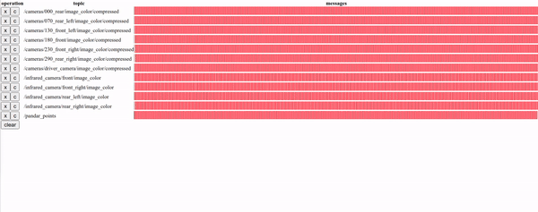

# rosbag_timeline



## what's new

rqt_bag has the same feature but the timestamps it shows are time when the message reached to `rosbag record`, not when the message was generated.

This tool shows message timestamp, with some auxiliary features you may like, such as topic ordering, coloring, and so on.


## How does it work
stamp_dump dumps all topics and message timestamps to a file named `data.js`. Note the stamps are message timestamp `header.stamp`, not rosbag view stamp, which is when the message was received by 'rosbag record').


`main.html` loads `data.js` and shows timelines, with some interacitve operations available.

## How to use
### build stamp_dump tool
```
cd tools
catkin_make
```
### dump stamps of some rosbag file
```
cd ..
./tools/devel/lib/stamp_dump/stamp_dump  path-to-bag.bag

```
### open main.html with your browser (chrome recommended).

